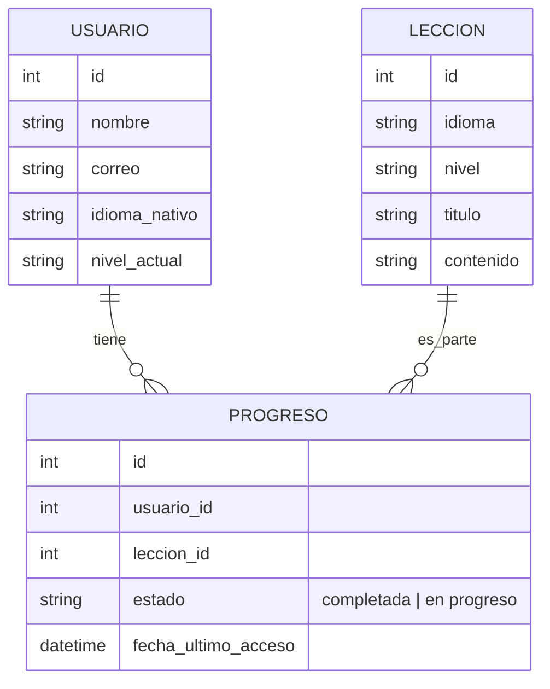

# Esquema de Base de Datos - LEXI: Aprende sin límites

_¿Cuáles son las entidades principales y relaciones en tu modelo de datos?_

---

## Diagrama ER

<small>(Diagrama adaptado para LEXI. Agrega más entidades según crezca el proyecto.)</small>

---

## Descripción

En LEXI, la entidad principal es el USUARIO, quien puede acceder a múltiples LECCIONES de diferentes idiomas y niveles. El PROGRESO registra qué lecciones ha iniciado o completado cada usuario, permitiendo personalizar la experiencia y sincronizar el avance entre dispositivos. Por ejemplo, una estudiante puede comenzar una lección de inglés nivel básico y continuarla más tarde desde otro dispositivo, manteniendo su progreso actualizado. Esta estructura soporta funcionalidades como acceso offline, retroalimentación inmediata y adaptación al nivel del usuario, alineadas con las historias de usuario y requerimientos del proyecto.

<small>Agrega más entidades y relaciones a medida que tu proyecto crezca.</small>
